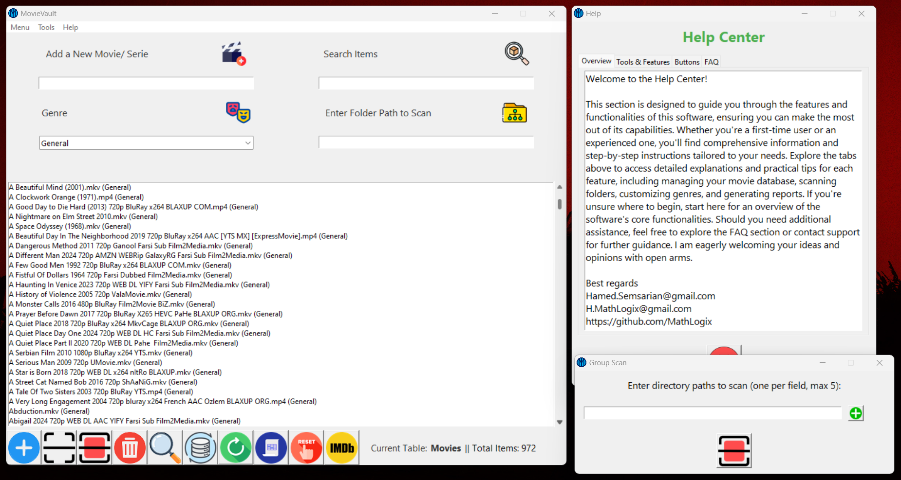
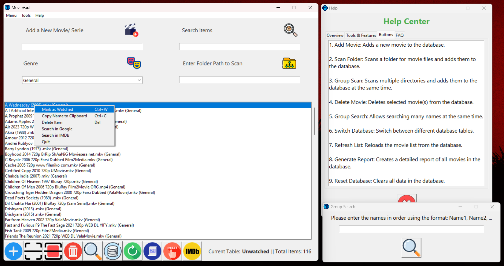

# 🎬 MovieVault - Movie Collection Organizer

MovieVault is a powerful Python-powered desktop application designed to help you effortlessly organize and manage your movie and series collection. Whether you're a casual viewer or a dedicated cinephile, MovieVault offers an intuitive and efficient way to keep track of your media library.

## 🌟 Key Features

📁 Group Folder Scan – Scan multiple directories simultaneously and automatically add movie files to the database.

🔎 Advanced Search – Find movies instantly with powerful search capabilities.

🗂️ Dynamic Database Management – Easily add, remove, and switch between multiple databases.

🎭 Genre Customization – Assign and manage movie genres effortlessly.

📊 Generate Reports – Export your movie collection in a structured report format.

🌐 IMDb Integration – Instantly search selected movies on IMDb for ratings and additional details.

🎨 Modern UI – A clean, intuitive, and user-friendly interface built with Tkinter.

♻️ Backup & Restore – Securely back up and restore your movie database to prevent data loss.

## 🤝 Contributing
We welcome contributions! If you have ideas for improvements or new features, feel free to fork the repository and submit a pull request. Your feedback and suggestions are invaluable!

For any questions or inquiries, contact me at:

📧 Hamed.Semsarian@gmail.com
📧 H.MathLogix@gmail.com

